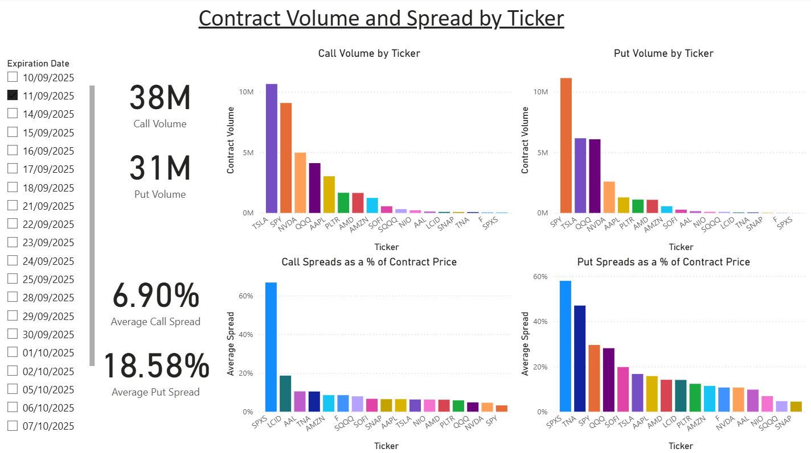
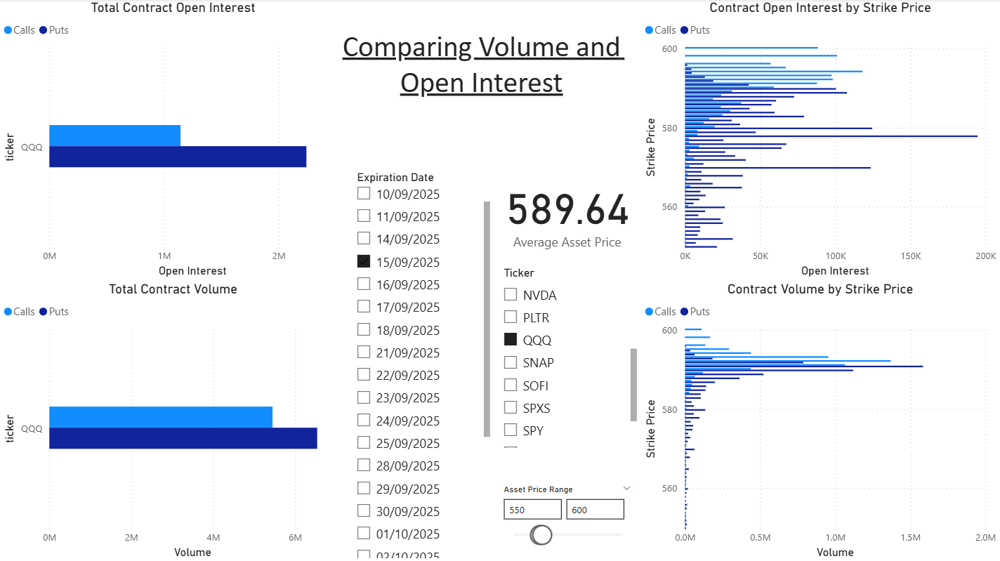
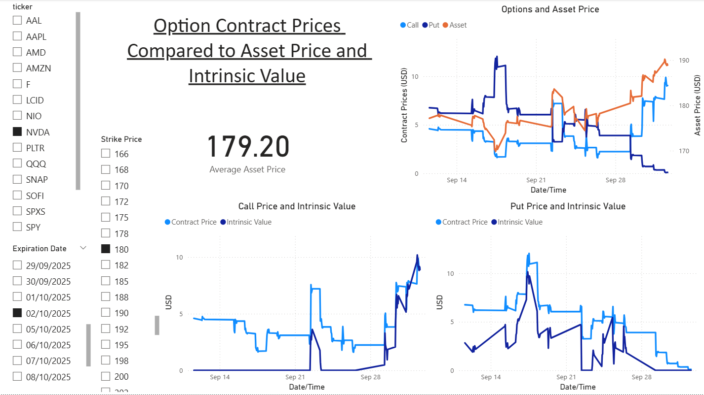
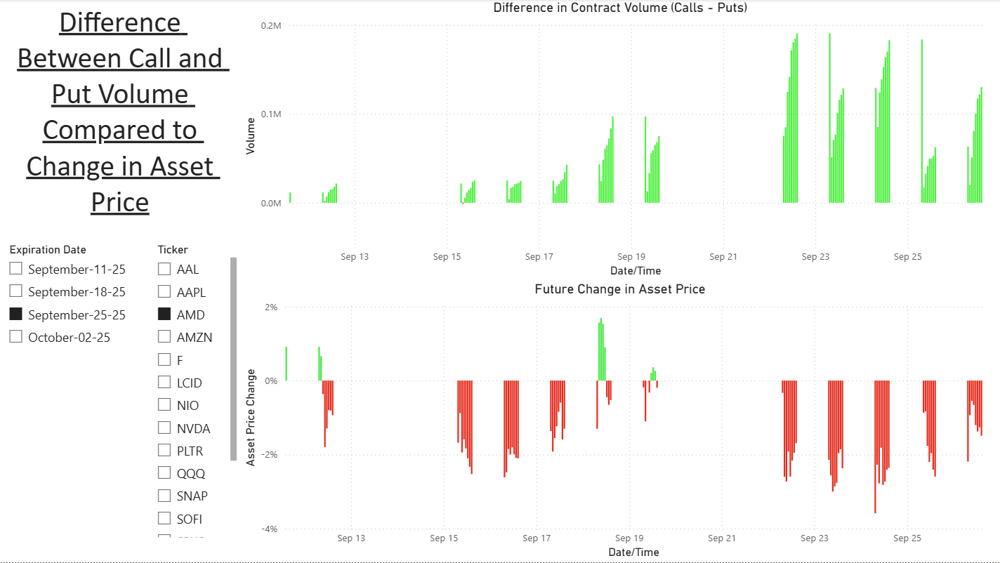

# Options Chain Data Pipeline

## Table of Contents
- [Overview](#overview)
- [Architecture Summary](#architecture-summary)
- [Power BI Visuals](#power-bi-visuals)

## Overview
Historical stock market data on normal assets is widely accessible for public use, while data on derivatives likes options is another story. For anything more than end of day or current options chain data, any member of the public usually has to pay. This purpose of this project is to create an automated data pipeline that periodically captures real-time options-chain data and stores it in a database, accumulating historical data that can be used for further analysis. This project is automated to save data at market close and once every hour that the market was open, though this can be adjusted in the airflow settings. One could easily set the pipeline to capture data at a much higher frequency; in this work, the script saves data on 16 different assets and takes about 20 seconds to run on average.

## Architecture Summary
### Data Collection
A Python script fetches real-time options-chain data from the yahoo finance API. The script transforms, cleans, and saves the data to a PostgreSQL database.
### Containerization
The Python script is packaged into a Docker image to ensure consistent execution across different environments.
### Orchestration
An AWS EC2 instance runs Apache Airflow in Docker to execute the data collection script according to the specified schedule.
### Storage
The data is stored in a PostgreSQL database hosted on AWS Relational Database Service (RDS).
### Analytics
Power BI connects directly to the RDS database to import and analyze the data.

## Power BI Visuals
### 1. Volume and Spread

This slide compares the total volume of option contracts with the average spread, sorted by ticker. One would assume that the contracts with trading volumes would have more efficient markets and therefore lower spreads. Generally speaking, we do see this trend here with the calls: The top 3 tickers with the most volume have the 3 smallest spreads, and the ticker with the lowest volume has by far the biggest spread. The puts also follow this trend but not as closely. For example, SPY puts have the most volume but also the 3rd biggest spread. SNAP puts have the smallest average spread but also very low volume. This visual can also be further filtered by contract expiration date.

### 2. Volume and Open Interest

This next slide depicts volume and open interest at varying strike prices for specific contracts. In this picture the contracts are QQQ options that epxire on the 15th of September. This slide only makes sense because the data began being collected only about a week before the options expiration date. If data on a contract is perfectly recorded, the open interest and volume in this visual would look the same because volume is not filtered by date but rather summed. That means the volume hear can be interpreted as a more recent reflection of market activity. With that in mind we can see that while open interest shows almost twice as many active puts than calls, the recent volume is more evenly split. The open interest strike price distribution shows lots of puts at 578, while the volume shows a recent peak around 590. The volume also shows a tighter overlap of calls and puts around 590, which is to be expected given that 590 is where the recent price is hovering.

### 3. Contract and Asset Price Action

This slide shows the price movement of a specific contract over time, compared to underlying asset price action as well as contract intrinsic value. This visual is particularly intersting becuase of how it illustrates theta decay. This call option had zero intrinsic value for almost the whole time period shown here, yet it was still trading around $4 per contract, with the price very slightly going down as time went on. However, closer to the exiration date the price of the underlying asset crosses above the strike price so the contract gains intrinsic value and the price increases. We can also see how the price of the call and the put were both above their respective intrinsic value but converge towards it as the expiration date approaches.

The "blocky" nature of these graphs are due to the periodic collection of data. Larger periods between collection would cause more "blockyness", while shorter periods would smooth out the curves.

### 4. Put and Call Volume Difference vs Asset Performance

This last slide compares the difference in volume of contract side and the resulting performance of the underlying asset. The top bars show the call volume minus the put volume, so a green bar indicates more calls being sold than puts. The bottom bars show the precent change in the price of the underlying at expiration date compared to the date on the graph. Here we can see that over a slightly more than 2 week period, more calls than puts were sold every day, and the underlying stock price was consistently lower on expiration date than at the time the contracts were sold. Whether these two trends are related can be interpreted many ways. What is also intersting it that there seems to be a consistent pattern in the selling of contracts. There is often a spike in calls near market open, while a spike in puts causes some rebalancing an hour later with a gradual increase in calls for the rest of the day. This is a key insight that normal end of day data would miss.

